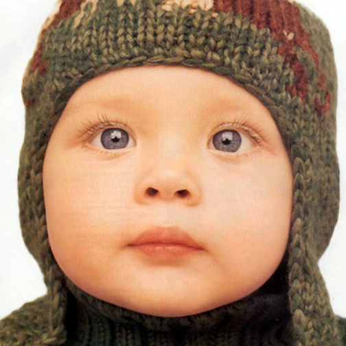
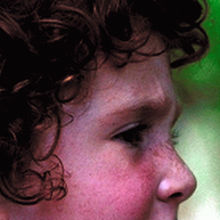
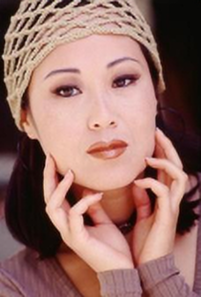
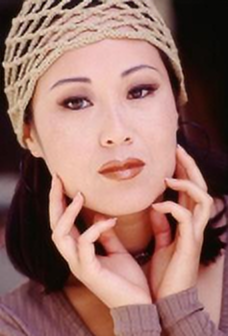

# RT4KSR Pytorch Lightning

This repository is implementation of the [Towards Real-Time 4K Image Super-Resolution](https://openaccess.thecvf.com/content/CVPR2023W/NTIRE/papers/Zamfir_Towards_Real-Time_4K_Image_Super-Resolution_CVPRW_2023_paper.pdf) at CVPR 2023. The official repository is [here](https://github.com/eduardzamfir/RT4KSR)

## Abstract

Over the past few years, high-definition videos and images in 720p (HD), 1080p (FHD), and 4K (UHD) resolution have become standard. While higher resolutions offer improved visual quality for users, they pose a significant chal- lenge for super-resolution networks to achieve real-time performance on commercial GPUs. This paper presents a comprehensive analysis of super-resolution model designs and techniques aimed at efficiently upscaling images from 720p and 1080p resolutions to 4K. We begin with a simple, effective baseline architecture and gradually modify its design by focusing on extracting important high-frequency details efficiently. This allows us to subsequently downscale the resolution of deep feature maps, reducing the overall computational footprint, while maintaining high reconstruction fidelity. We enhance our method by incorporating pixel-unshuffling, a simplified and speed-up reinterpretation of the basic block proposed by NAFNet, along with structural re-parameterization. We assess the performance of the fastest version of our method in the new [NTIRE Real-Time 4K Super-Resolution](https://cvlai.net/ntire/2023/) challenge and demonstrate its potential in comparison with state-of-the-art efficient super-resolution models when scaled up. Our method was tested successfully on high-quality content from photography, digital art, and gaming content.

## Installation
Python = 3.8.10

I use version `pytorch = 2.1.2 + cuda 11.8`, `lightning = 2.1.1`. I'm not sure if it works with other versions.

Then install the requirements: `pip install -r requirements.txt`

## Dataset Preparation

I use [DIV2K](https://data.vision.ee.ethz.ch/cvl/DIV2K/) and Flickr2K dataset for training and DIV2K validation set for validation. You can download the DIV2K dataset from [here](https://data.vision.ee.ethz.ch/cvl/DIV2K/) and Flickr2K dataset from [here](https://huggingface.co/datasets/goodfellowliu/Flickr2K/resolve/main/Flickr2K.zip). 

In the training dataset, to increase the number of images, we crop the original images on the dataset to the smaller ones with sizes `300×300`, and the step is `150`, similar to sliding window cropping. Thanks to this strategy, from the original dataset with `3,450` images, we have a new training dataset with nearly `323,296` images. We also do the same with the validation set and get `9,708` validation images. This strategy is referenced from https://github.com/Lornatang/ESRGAN-PyTorch. You can refer to the script `prepare_dataset.py` in the `utils` folder to prepare the dataset.

## Training Strategy

**Reproduce strategy:** Applying the same strategy with the paper, we extract random crops of size 256×256 from the RGB training set and further augment the crops by random rotation (0◦,90◦,180◦,270◦), random horizontal and random vertical flipping. LR images are generated online using bicubic downsampling of the original HR images. We evaluate the generated validation dataset consisting of 100 images from DIV2K. 

**Hyperparameters:** In the original paper, the author used ADAM optimizer, but in this reproduced version, instead of using ADAM optimizer, we use ADAMW optimizer with β1 = 0.9,β2 = 0.999 to minimize the L1 loss between the SR output and HR target for 100 epochs with the batch size set to 64 and an initial learning rate of 1e − 3, along with a step scheduler with step size 20 epochs and decay factor 0.5. By applying some small improvements we achieved slight improvement compared to the baseline on 4 common validation datasets.

## Results

### Quantitative Results

Quantitative comparison with the Original RT4KSR. We compare based on two scores PSNR and SSIM (Y) for ×2 on standard benchmarks. The best results are highlighted in bold.

| Model                    | Set5        | Set14       | BSD100      | Urban100     |
| :---:                    | :---:       | :---:       | :---:       | :---:        |
| RT4KSR                   | 36.09/.9508 | 31.75/.9026 | 31.07/.8836 | 28.72/.8849  |
| Reproduced RT4KSR (ours) | **36.31/.9524** | **31.85/.9040** | **31.16/.8849** | **28.89/.8879**  |

### Visual Results

The visual comparison of the reproduced RT4KSR (ours) with the original RT4KSR and the baseline model on 5 images from the Set 5 dataset. The results are shown in the following table. The reproduced RT4KSR (ours) achieves slightly better visual results than the baseline model and is comparable to the original RT4KSR.

| LR (low resolution) | RT4KSR (original) | RT4KSR (ours) | HR (high resolution) |
|:---:|:---:|:---:|:---:|
|  |  |  |  |
|  |  |  |  |
|  |  |  |  |
|  |  |  |  |
|  |  |  |  |

## Contribution

Thong Doan Tien